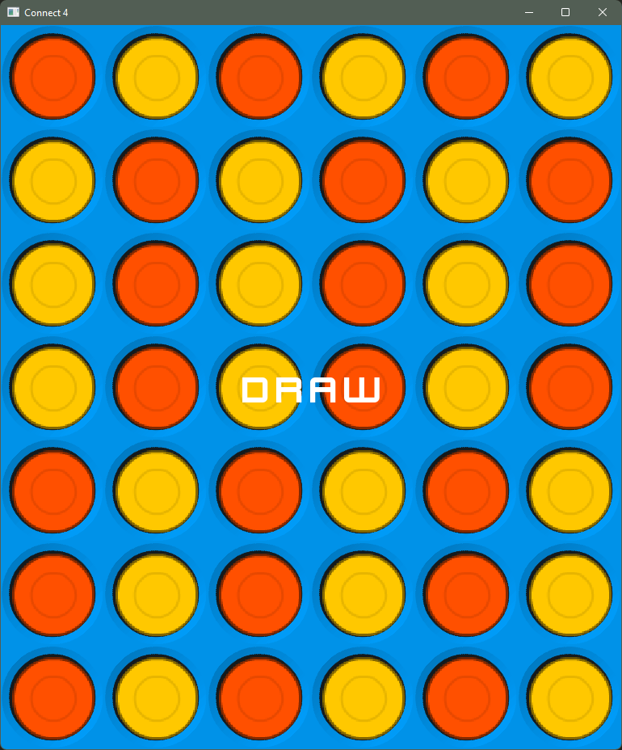

# Connect4-using-SFML
This is a Connect4 Game made with sfml and C++. This game uses lots of OOPs concepts and heavily incorporates the use of Data structures. The aim of the game is to get more than 3 coins of the same color lined up vertically, horizontally, or diagonally. The player that achieves this wins. And if all the slots are filled then it's a Draw.

# Features
- Co-op game
- Automatically switch turns when one player is done
- Win, lose & Draw conditions are implemented
- Customizable code architecture

# TO PLAY:
- Download the zip file
- upzip
- Go inside the folder
- Run the exe file

# Screenshots

